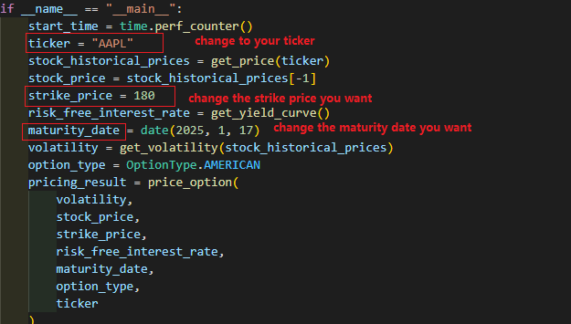
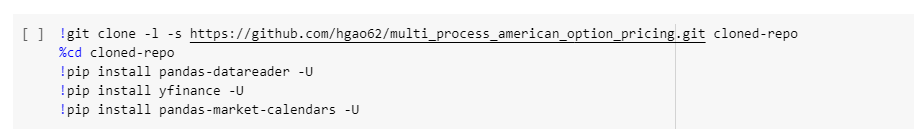

# Option pricing example using python

### Two options to run the code(Run them locally or run on Google Cloud). See instructions below for each

### First Option: Run code locally(Slow, takes around 3-5 minutes on my computer)


#### 1.  create virtual environment by running command below

```cmd
python -m venv .venv

```

#### 2. Install all the project dependency using by running command below

```cmd
pip install -r requirements.txt
```
#### 3. Activate your virtual environment()
```cmd

.venv\scripts\activate

```
#### 4. Go to option_pricing_api.py and price your preferred option by changing parameters as shown in screenshot below and run this file( make sure your virtual environment is activated or selected)





### Second Option: Run code google cloud(很快 30 秒左右， 不需要任何安装， 新手推荐这个选项）

1. Go to [Google Colaboratory](https://colab.research.google.com/notebooks/intro.ipynb#recent=true) in your browser
2. Click "File" and then click "Open notebook" and then select `GitHub`
3. Enter the URL of this repository's notebook, e.g.: `https://github.com/hgao62/multi_process_american_option_pricing/blob/develop/price_option.ipynb`
4. Click the search icon
5. As you open the notebook in Google Colaboratory,不要忘了run 第一个cell 的代码


